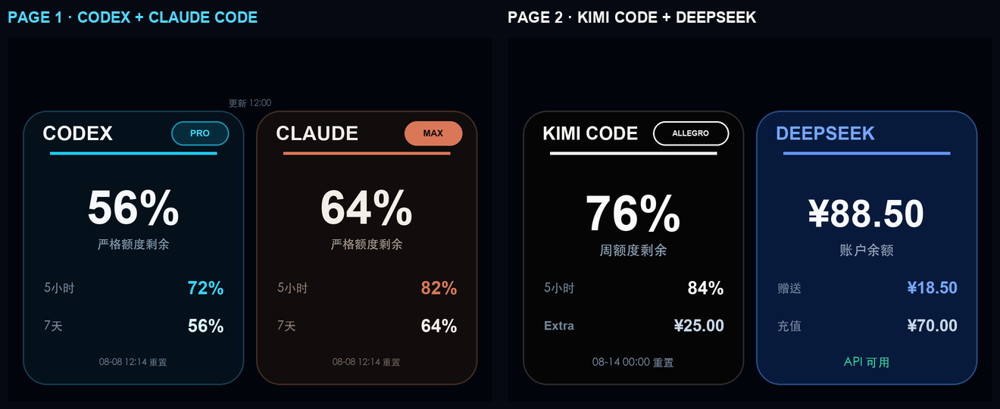
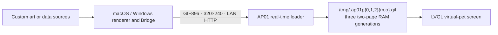

<div align="center">
  
  

  # CUKTECH Screen Controller

  **Custom screens and a verified two-page coding dashboard for CUKTECH AP01.**

  Codex + Claude Code · Kimi Code + DeepSeek · LAN refresh · RAM-backed updates

  [](#advanced-and-manual-setup)
  [](#platform-support)
  [](#method-1--install-the-desktop-app)
  [](#first-time-real-time-firmware-setup)
  [](#screen-contract)
  [](LICENSE)

  [Platform support](#platform-support) · [Windows guide](docs/WINDOWS_GUIDE.md) · [Preparation checklist](docs/PREPARATION_CHECKLIST.md) · [Beginner guide](docs/BEGINNER_GUIDE.md) · [Install the app](#method-1--install-the-desktop-app) · [Use with a coding agent](#method-2--give-this-repository-to-a-coding-agent)

  [English](README.md) · [简体中文](README.zh-CN.md) · [Visual Tutorial](docs/xiaohongshu-tutorial.zh-CN.md) · [Skill](#coding-agent-skill)
</div>

---

> [!NOTE]
> This is a modified community fork of
> [`wqytommy666/cuktech-screen-controller`](https://github.com/wqytommy666/cuktech-screen-controller),
> not a from-scratch replacement. It preserves the upstream Git history and
> MIT copyright notice. See [upstream attribution and fork changes](NOTICE.md).

## Verified on real hardware: two coding-balance pages

This is a working device implementation, not a concept mockup. The owner has
verified both pages on `njcuk.enstor.ap01 / 1.0.2_0031` after repeated build,
installation and recovery tests. The preview below uses synthetic values and
contains no account balance, token, device address or Mi Home data.



| Knob page | Content | Source |
| --- | --- | --- |
| stock virtual-pet page, `window 7` | Codex Pro + Claude Code Max | official Codex `app-server`; official Claude Code `statusLine` |
| stock weather page, `window 5` | Kimi Code Allegro + DeepSeek | local Kimi Code OAuth; official DeepSeek balance API |

The real carousel order is `Settings 6 → Codex/Claude 7 → Kimi/DeepSeek 5 → Date 4 → Time 3 → Power 0 → Settings 6`.
This mapping matters: `window 0` is Power, not Weather. Targeting the wrong
window is what makes a custom page appear beside Settings or overwrite Power.

Search terms: CUKTECH 10 charging station display, AP01 firmware mod, AP01
custom screen, Codex/Claude Code/Kimi Code balance dashboard.

The implementation uses an **AP2B two-page bundle with one active GIF decoder**.
Page 1 reuses the stock pet GIF object; page 2 adds one object to the stock
Weather page. The non-selected page points at a 1×1 tmpfs placeholder. This
avoids the white screens caused by multiple full-size decoders while keeping
Settings, Date, Time and Power intact.

See the [real-device two-page runbook](skills/cuktech-ap01-screen-kit/references/two-page-coding-dashboard.md)
for reproduction, diagnostics and recovery.

> [!CAUTION]
> Binary offsets support only the exact model/version above. This repository
> does not distribute CUKTECH/Xiaomi firmware and never commits user firmware,
> signed OTA URLs, credentials, cookies, DIDs or LAN addresses.

> [!IMPORTANT]
> The verified two-page recipe does not read Claude Desktop or browser cookies:
> it accepts only Claude Code's official `statusLine.rate_limits` input. The
> repository retains an older cookie-based one-page collector for compatibility;
> it is excluded from the Skill's recommended workflow. Signed OTA URLs are
> accepted only from private files, never from command-line values or logs.

## Choose how you want to use it

CUKTECH Screen Controller provides two ways to control the AP01 display.

> New to developer tools? Start with the
> [step-by-step beginner guide](docs/BEGINNER_GUIDE.md).

> **No Xiaomi gateway is required.** A stock AP01 only needs stable power,
> an online Mi Home pairing, and a computer on the same LAN. The app's
> gateway-free onboarding action obtains a restricted FDS ticket and still
> asks for explicit confirmation immediately before the one-time Flash write.

| | Method 1: macOS / Windows app | Method 2: coding agent on macOS / Windows |
| --- | --- | --- |
| Best for | Everyday use with a native UI | First-time setup, diagnostics and deep customization |
| Interface | CUKTECH Screen Controller desktop app | Claude Code, Codex, OpenCode, WorkBuddy or another terminal-capable agent |
| Custom images | Choose PNG, JPG or GIF and push | Convert, validate and deploy through repository tools |
| Quota dashboard | Live Claude and Codex on both systems | Four-provider two-page workflow on macOS |
| First-time loader | Gateway-free package, BFNP preflight and confirmed install | Complete compatibility, build and installation workflow |
| Daily refresh | Wi-Fi update to AP01 RAM | Wi-Fi update to AP01 RAM |

## Platform support

The complete daily-use workflow is available on both platforms:

- **macOS:** native SwiftUI app for Apple Silicon, macOS 14 or later;
- **Windows:** native-feeling PySide6 app for 64-bit Windows 10 and 11;
- both apps provide live preview, custom images/GIFs, Claude/Codex quota mode,
  Bridge status, login startup, onboarding, and gateway-free OTA setup;
- the **Python and coding-agent toolkit** also runs on both systems for image
  conversion, validation, diagnostics and deeper customization;
- Windows uses `scripts/setup-windows.ps1` and
  `scripts/diagnose-windows.ps1`; macOS uses the scripts under `macos/`.

See the [Windows guide](docs/WINDOWS_GUIDE.md).

## Method 1 — Install the desktop app

Download the latest **CUKTECH Screen Controller** package from
[GitHub Releases](https://github.com/zhuoshiren/cuktech-screen-controller/releases/latest).

- **Windows 10/11 x64:** extract
  `CUKTECH-Screen-Controller-0.4.1-Windows-x64.zip`, then double-click
  **`Install CUKTECH Screen Controller.cmd`**. See the
  [Windows guide](docs/WINDOWS_GUIDE.md).
- **Apple Silicon macOS:** extract
  `CUKTECH-Screen-Controller-v0.4.1-macOS-arm64.zip`, then double-click
  **`Install CUKTECH Screen Controller.command`**.

Both installers enable the login background Bridge. The Windows package is
self-contained; the macOS installer creates its isolated Python runtime on the
first run.

### Current requirements

- macOS 14+ on Apple Silicon **or** Windows 10/11 x64;
- host computer and AP01 on the same non-isolated LAN;
- Claude Desktop and the official Codex app already signed in for quota mode;
- internet access for live quotas and first-time OTA operations.
- users do **not** need to buy a Xiaomi gateway; the shared FDS relay is used
  only during the one-time loader setup.

### Network and device preparation

> [!IMPORTANT]
> **Reserve the Bridge computer's IP before the first loader installation.**
> AP01 stores a literal `http://COMPUTER_IP:8765/screen.ap2b` URL for the
> two-page loader (legacy one-page builds use `/screen.gif`) and does not
> follow DHCP changes. Prefer a router DHCP reservation. If the address later
> changes, restore the old address first (no Flash write); only when that is
> impossible should you stabilize a new address and rebuild/reinstall the
> loader (one Flash write). See the
> [Bridge IP reservation and recovery guide](docs/STABLE_IP_GUIDE.md).

| Scenario | AP01 / charging station | Host computer | Internet required? |
| --- | --- | --- | --- |
| Already-patched screen showing local artwork | Powered and connected to the home LAN | Same reachable LAN with Bridge running | No; local LAN is enough |
| Claude / Codex quota dashboard | Powered and connected to the home LAN | Same LAN with the official apps signed in | **Host computer: yes**, to refresh quota data |
| First loader installation on a stock screen | Paired and online in Mi Home, with stable power | Internet access and the same reachable LAN | **AP01 and host computer: yes** |

- Normal screen delivery uses **Wi-Fi/LAN**, not USB or the base contacts;
- do not use a guest network, and disable AP/client isolation. Ethernet on the
  host is fine when it can reach the AP01 on the same LAN;
- allow incoming connections when macOS or Windows asks. VPNs and firewalls must allow local
  LAN access to TCP port `8765`;
- before a first loader installation, have the AP01 owner's Mi Home account
  available and verify model `njcuk.enstor.ap01` and firmware `1.0.2_0031`;
- keep the host awake and logged in for live refreshes. The current persistent
  two-page mode keeps the last rendered image while the host is unreachable;
  use the on-screen refresh timestamp to judge freshness;
- **before installing the loader**, reserve the host's DHCP address in the
  router. On macOS keep Private Wi-Fi Address fixed rather than rotating and
  bind the MAC currently shown by the router;
- if the router cannot reserve an address, explicitly plan for restoring the
  embedded old IP after a DHCP change or rebuilding/reinstalling the loader
  once for a stabilized new IP. Do not repeatedly flash while the IP is still
  changing.

See the full [preparation and connectivity checklist](docs/PREPARATION_CHECKLIST.md).

The app can show Bridge status, switch between quota and custom artwork,
preserve animated GIFs, select `contain` / `cover` / `stretch`, and automate
the gateway-free package, BFNP preflight, host-side CDN readback verification and
explicitly confirmed installation.

<div align="center">
  
</div>

<div align="center">
  
</div>

> The app never silently installs firmware. It performs read-only Mi Home
> checks, obtains and verifies the package, then presents a separate explicit
> confirmation immediately before the one-time loader install.

## Method 2 — Give this repository to a coding agent

Copy this repository URL into Claude Code, Codex, OpenCode, WorkBuddy, or
another coding agent that can read GitHub and run terminal commands:

```text
https://github.com/zhuoshiren/cuktech-screen-controller
```

Suggested prompt:

```text
Use https://github.com/zhuoshiren/cuktech-screen-controller as the source of
truth. Read AGENTS.md, README.md and
skills/cuktech-ap01-screen-kit/SKILL.md first.

I am not a programmer, so ask for one manual action at a time. I have a
CUKTECH AP01 detachable display. Detect whether this computer runs macOS or
Windows. On macOS run ./macos/diagnose.sh. On Windows read
docs/WINDOWS_GUIDE.md and run scripts/diagnose-windows.ps1. Start with read-only
compatibility and network checks. Confirm the LAN address, Bridge health, and
whether the real-time loader is already installed.

Before any first-loader build, identify the Bridge computer's current IP and
MAC in the router, create a DHCP reservation, reconnect, and prove that the
address remains unchanged. If the router cannot reserve it, explain that AP01
stores a literal IP: later address changes require restoring the old IP, or
stabilizing a new IP and rebuilding/reinstalling the loader with confirmation.

Then reproduce the verified two-page layout: Codex + Claude Code on page one,
Kimi Code + DeepSeek on page two. Use only official local sessions and keep the
DeepSeek key in macOS Keychain. Verify /health and an AP01 GET /screen.ap2b 200 request, and
enable automatic startup for the current operating system. If the loader is missing, build
and validate the exact compatible image first and ask before installing it.
Normal screen refreshes must use the RAM-backed /tmp slots and must not
reinstall firmware.
```

Agents without native Codex Skill support can still read `SKILL.md` as a
complete operating guide.

The repository also includes `AGENTS.md`, `CLAUDE.md`, a read-only diagnostic,
and setup/diagnostic commands for both platforms:

```bash
./macos/diagnose.sh
./scripts/setup-macos.sh

# Windows PowerShell
.\scripts\diagnose-windows.ps1
.\scripts\setup-windows.ps1 -InputImage "C:\Pictures\screen.png"
```

## One-time installation and daily refreshes are different

- **One-time loader installation:** writes firmware Flash once and supports
  only model `njcuk.enstor.ap01` on firmware `1.0.2_0031`.
- **Normal image and quota refreshes:** rotate two-page GIFs through
  `/tmp/.ap01p{0,1,2}{m,o}.gif`, which is RAM-backed. They do not rewrite firmware or
  resource partitions.
- If the Bridge computer goes offline, persistent two-page mode keeps the last
  successful image and resumes refreshes when the Bridge returns. Check the
  displayed refresh timestamp before treating the values as current.

### How to tell whether quota data is current

- the Bridge reads the four official local/API sources every five minutes;
- each live plan badge includes a green status dot and the latest successful
  refresh time for comparison with the AP01 clock;
- a temporary provider failure keeps its last successful value in persistent
  mode and records the error in local `/health` and the sanitized JSON;
- when the host is off, the on-screen refresh time stops advancing. Persistent
  display is intentional; do not interpret an old timestamp as a fresh value;
- the next successful refresh automatically restores the live dashboard.

## What is this?

CUKTECH Screen Controller provides native macOS and Windows apps plus a cross-platform toolkit for the detachable display used
by the CUKTECH 10 charging station (`njcuk.enstor.ap01`). It provides a clean
workflow for:

- turning any image into a lightweight AP01-safe animated GIF;
- designing a high-legibility 320×240 status screen;
- rendering live balances from Codex, Claude Code, Kimi Code and DeepSeek;
- serving updates from a macOS or Windows computer over local Wi-Fi;
- installing the one-time AP01 `1.0.2_0031` real-time loader;
- changing content later without another firmware install.

The included quota dashboard is only a starting point. Replace it with artwork,
calendar, weather, energy telemetry, build status, Home Assistant metrics, or
any screen you want.

## Highlights

| Custom screen | Two-page coding dashboard | Lightweight runtime |
| --- | --- | --- |
| Convert artwork to a verified 320×240 GIF89a asset. | Codex/Claude strict limits, Kimi week/5-hour, and DeepSeek balance. | Bounded animation, typically under 90 KB. |
| `contain`, `cover`, and `stretch` layouts. | Codex/Claude and Kimi/DeepSeek each occupy a physical knob page. | AP01 stores updates in RAM-backed `/tmp`, not its resource partition. |

## Architecture



The first firmware installation adds the loader. Every later screen refresh is
fetched over Wi-Fi and rotated through RAM-backed files.

## Advanced and manual setup

### 1. Create a local environment

```bash
git clone https://github.com/zhuoshiren/cuktech-screen-controller.git
cd cuktech-screen-controller
python3 -m venv .venv
.venv/bin/python -m pip install -r requirements.txt
```

Windows PowerShell:

```powershell
py -3 -m venv .venv
.\.venv\Scripts\python.exe -m pip install -r requirements.txt
```

### 2. Make a custom screen from any image

```bash
.venv/bin/python ap01_prepare_screen.py ./my-artwork.png artifacts/screen.gif \
  --fit contain --background '#01040B'
.venv/bin/python ap01_screen_bridge.py artifacts/screen.gif --port 8765
```

The converter outputs a 320×240 GIF89a. Still images become a reliable two-frame
container; animated GIFs retain visible motion with bounded frame count and
timing. Replace `artifacts/screen.gif` atomically whenever you want new content;
the AP01 will retrieve it on its next refresh.

### 3. Run the four-provider two-page dashboard (macOS)

Sign in to Codex, Claude Code and Kimi Code. Store the DeepSeek API key directly
in macOS Keychain through the secure prompt:

```bash
swift macos/store-deepseek-key.swift
```

Claude usage comes from the official `statusLine` input. Add this side effect
to the existing status-line script after it has captured stdin as `$input`;
continue rendering the original status line from that same variable:

```bash
printf '%s' "$input" | /ABSOLUTE/REPO/.venv/bin/python \
  /ABSOLUTE/REPO/claude_statusline_cache.py 2>/dev/null || true
```

Allow-list the AP01 private IPv4 and start the two-page bridge:

```bash
printf '%s\n' 'AP01_PRIVATE_IP' > artifacts/ap01-ip
printf '%s\n' 'coding' > artifacts/ap01-mode
./macos/ap01-bridge-runner.sh
```

Inspect `artifacts/coding-balances-codex-claude@2x.png` and
`artifacts/coding-balances-kimi-deepseek@2x.png`. The bridge exposes:

```text
http://COMPUTER_LAN_IP:8765/screen.gif
http://COMPUTER_LAN_IP:8765/screen.ap2b
http://127.0.0.1:8765/api/v1/balances
http://COMPUTER_LAN_IP:8765/health
```

The JSON endpoint is localhost-only. LAN content is restricted to the AP01
allow-list and local host addresses. See the
[two-page real-device runbook](skills/cuktech-ap01-screen-kit/references/two-page-coding-dashboard.md)
for complete provider setup and validation.

## First-time real-time firmware setup

The built-in binary patch targets **only** AP01 model `njcuk.enstor.ap01` on
firmware **`1.0.2_0031`**. Keep the Bridge computer and AP01 on the same
non-isolated LAN and reserve that computer's DHCP address before building the URL.

Treat the reservation as a precondition rather than an optional optimization.
Follow the [stable-IP guide](docs/STABLE_IP_GUIDE.md), reconnect the host, and
verify the reserved address before generating the firmware.

```bash
# Confirm and download the matching stock image through the signed-in Mi Home account.
.venv/bin/python mi_cloud.py firmware
.venv/bin/python mi_cloud.py download

# Build a fallback screen image and inject the local HTTP loader.
.venv/bin/python ap01_custom_ota.py artifacts/screen.gif \
  --firmware artifacts/ap01-1.0.2_0031.bin \
  --output artifacts/ap01-1.0.2_0031-screen-compat.bin

.venv/bin/python ap01_realtime_patch.py \
  --input artifacts/ap01-1.0.2_0031-screen-compat.bin \
  --output artifacts/ap01-1.0.2_0031-screen-realtime.bin \
  --build-dir artifacts/realtime-build \
  --url http://COMPUTER_LAN_IP:8765/screen.ap2b \
  --refresh-seconds 300

# Upload, then have this computer read the entire CDN object back. This does not contact AP01.
.venv/bin/python ap01_install_firmware.py \
  artifacts/ap01-1.0.2_0031-screen-realtime.bin \
  --upload-only --url-output /tmp/ap01-ota-url.txt
.venv/bin/python ap01_install_firmware.py \
  artifacts/ap01-1.0.2_0031-screen-realtime.bin \
  --verify-download --ota-url-file /tmp/ap01-ota-url.txt

# Install the exact same image only after the owner explicitly confirms.
.venv/bin/python ap01_install_firmware.py \
  artifacts/ap01-1.0.2_0031-screen-realtime.bin \
  --install --ota-url-file /tmp/ap01-ota-url.txt
```

Start the bridge before the final installation. A bridge log such as
`AP01_IP "GET /screen.ap2b" 200` confirms two-page end-to-end operation.

### Xiaomi FDS upload prerequisite

#### Normal users: no gateway required

CUKTECH Screen Controller 0.4 includes a restricted shared FDS relay flow. The
desktop app sends only its private-LAN Bridge URL, refresh interval, target
model and firmware version. Mi Home credentials, AP01 DID, passwords, tokens,
and Claude/Codex sessions never leave the owner's computer. The relay rejects
arbitrary firmware uploads and builds only the reviewed loader from a
SHA-256-pinned `1.0.2_0031` stock image.

The app checks model/version and online state, downloads and verifies the
BFNP image, reads the complete CDN object back on the host, and finally asks for
explicit install confirmation. The user's own Mi Home session still sends the
OTA command to their own AP01. After that one-time step, all screens use LAN
and RAM; neither the shared relay nor a gateway is needed for daily use.

See the [relay operator guide](docs/FDS_RELAY_OPERATOR.md) for the protocol,
deployment and security boundaries.

#### Advanced users: own gateway or manual ticket

The AP01 itself has no server-side FDS upload configuration. Passing the AP01
DID/model to `/home/genpresignedurl` therefore returns `code=-6` (`invalid
config for fds`). In the original transport, these are two different device
identities:

- an FDS-enabled `lumi.gateway.*` or `xiaomi.gateway.*` identity obtains the
  signed upload URL;
- the AP01 DID receives the later `miIO.ota` download command.

There is no AP01 bucket, model alias, or hard-coded object name to enter. If
the AP01 owner's account has no FDS-enabled gateway, a trusted gateway account
can upload the **exact same BIN** and pass the short-lived signed URL back.

On the uploader's Mac/account:

```bash
.venv/bin/python ap01_install_firmware.py \
  artifacts/screen-realtime.bin \
  --upload-only --url-output /tmp/ap01-ota-url.txt
```

If automatic discovery is ambiguous, add a real gateway identity owned by
that account: `--fds-did DID --fds-model lumi.gateway.MODEL`.

On the owner's Mac, immediately perform the host-side readback without
contacting AP01:

```bash
.venv/bin/python ap01_install_firmware.py \
  artifacts/screen-realtime.bin \
  --verify-download --ota-url-file /path/to/ap01-ota-url.txt --timeout 360
```

The command downloads the whole object from the official OTA CDN and compares
BFNP, size, SHA-256 and MD5. It creates no Mi Home session and sends no OTA to
AP01. The old `--download-only` path is disabled because AP01 1.0.2_0031 may
continue into installation. Both sides must use identical BIN bytes.

For an agent-ready Chinese runbook with diagnostics and completion criteria,
see [AP01 FDS solution without a local gateway](docs/AP01_FDS_NO_GATEWAY_SOLUTION.zh-CN.md).

## Screen contract

| Requirement | Value |
| --- | --- |
| Physical display | 320×240 |
| Container | GIF89a |
| Animation | At least 2 frames; slow animation is preferred |
| Recommended size | ≤ 90 KB |
| Firmware slot limit | 221,445 bytes |
| Runtime loader limit | 256 KiB |
| Overlay reserve | Leave rows 0–39 clear to preserve the stock clock/date |

## Flash behavior

Firmware installation is a one-time Flash write. Normal content and quota
refreshes are different: the loader writes GIF slots, metadata, and its ACK
record only to these RAM-backed paths:

```text
/tmp/.ap01p{0,1,2}{m,o}.gif
/tmp/.ap01q.meta
/tmp/.ap01q.ack
/tmp/.ap01q.ui
/tmp/.ap01blank.gif
```

That means changing artwork or refreshing quotas does **not** repeatedly write
the AP01 firmware or resource partitions.

## Privacy

- Codex, Claude Code and Kimi Code use official local signed-in state;
  DeepSeek uses its official balance API.
- the Claude cache keeps only rate-limit percentages, reset times and plan; it
  excludes session IDs, transcript paths/content and tokens. The DeepSeek key
  stays in macOS Keychain.
- rendered quota files are mode 0600; raw JSON contains sanitized values only
  and is localhost-only. Screen endpoints accept only localhost and the exact
  RFC1918 AP01 allow-list without logging either address.
- The repository excludes firmware images, Xiaomi account credentials, signed
  download URLs, device IDs, local IP addresses, and generated artifacts.

## Coding-agent Skill

This repository includes a self-contained Codex skill:

```bash
cp -R skills/cuktech-ap01-screen-kit ~/.codex/skills/
```

Then use prompts such as:

```text
Use $cuktech-ap01-screen-kit to turn this image into an AP01 screen.
Use $cuktech-ap01-screen-kit to safely deploy the verified two-page Codex, Claude Code, Kimi Code and DeepSeek dashboard.
Use $cuktech-ap01-screen-kit to diagnose why AP01 is not refreshing.
```

The skill contains the reusable project template, deterministic converters,
firmware workflow, network checks, and bilingual task guidance.

## Repository layout

```text
ap01_prepare_screen.py     Convert arbitrary images into AP01-safe GIFs
ap01_screen_bridge.py      Serve mutable artwork over LAN
quota_dashboard.py         Legacy one-page renderer and compatibility collector
ap01_wifi_bridge.py        Refresh and serve the quota dashboard
coding_balances_bridge.py  Render and serve the four-provider AP2B bundle
claude_statusline_cache.py Cache only official Claude Code rate-limit fields
ap01_realtime_patch.py     Build the 1.0.2_0031 RAM-backed loader
ap01_install_firmware.py   Deliver an already-built image through Xiaomi OTA
realtime_payload/          AP01 loader source
skills/                    Installable Codex skill
macos/                     SwiftUI app, installer and release packager
windows/                   Windows GUI, runtime, installer and release packagers
scripts/*windows.ps1       Windows source setup and read-only diagnostics
```

## Development

```bash
.venv/bin/python -m unittest discover -v
.venv/bin/python scripts/render-two-page-demo.py
```

See [CONTRIBUTING.md](CONTRIBUTING.md) for contribution conventions and
[SECURITY.md](SECURITY.md) before sharing logs or reporting a vulnerability.
The project is released under the [MIT License](LICENSE); upstream authorship
and this fork's modification scope are recorded in [NOTICE.md](NOTICE.md).

This project is not affiliated with or endorsed by CUKTECH, Xiaomi, OpenAI,
Anthropic, Moonshot AI or DeepSeek. Their trademarks belong to their owners.
